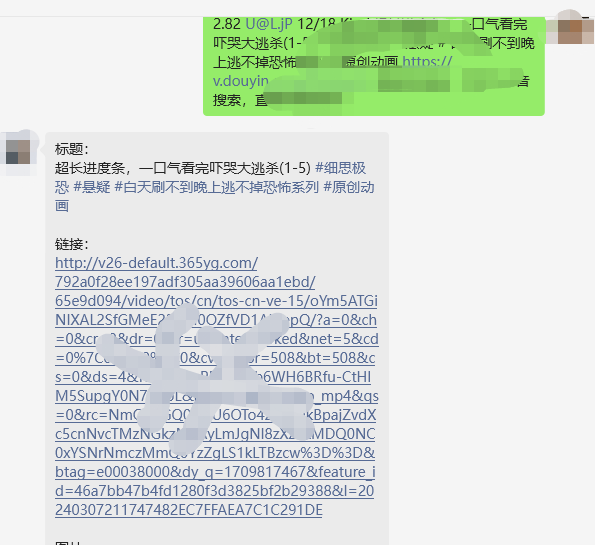

# 微信视频去水印机器人 🤖

微信去水印机器人是一个基于Python 3.11开发的项目，它通过调用各大自媒体平台API，实现从视频链接中提取原始视频（去水印版本）的功能。该机器人利用微信的原生能力，与人工智能技术集成，以帮助用户快速获取无水印的视频链接，支持多种自媒体平台，包括抖音、快手、微博等。

## 特色功能 ✨

- **多平台支持**：支持从多个自媒体平台提取无水印视频。
  - 包括但不限于：抖音、快手、小红书、 视频号、微博等平台
- **高效处理**：快速响应用户请求，提供无水印视频链接。
- **简单易用**：用户将链接发送给微信即可轻松使用，无需复杂操作。
- **隐私安全**：不存储用户数据，尊重用户隐私。
- **自动通过好友申请**：自动通过好友申请，确保用户能够正常使用，无需人工操作，引流利器。

## 系统要求 💻

- **适用于任何安装了Python 3.11的操作系统**
- **Python 3.11**

## 安装 🔧

### 启动程序

1. 克隆仓库到本地：`git clone https://github.com/kawika-git/WeChat-Video-Dewartermark.git`
2. 进入项目目录：`cd WeChat-Video-Dewartermark`
3. 创建虚拟环境并激活：`python -m venv venv`，然后 `venv\Scripts\activate` (Windows) 或 `source venv/bin/activate` (Unix/macOS)
4. 安装依赖：`pip install -r requirements.txt`
5. 修改配置文件：`.env` 文件中填写相关配置信息
6. 运行程序：`python app.py`

## 常见问题

- **视频号没有链接复制，你是如何做的？**
  - 神奇吧，这里是通过三方API完成的，推荐地址：[视频号去水印](https://sourl.cn/nhdDPM)
  - 推荐原因：稳定、价格低、售后服务好
- **为什么那么多自媒体平台都支持**
  - 这里也是通过三方API完成的，推荐地址：[自媒体平台去水印](https://sourl.cn/nhdDPM)
  - 推荐原因：稳定、价格低、支持的自媒体平台多
- **你是怎么监控微信消息的？**
  - 这里也是通过三方API完成的，推荐地址：[API启动器来源](https://github.com/kawika-git/wechatAPI)
  - 推荐原因：稳定、价格低、不封号

## 如何贡献 🤝

欢迎通过Pull Requests来贡献您的代码或文档改进。请确保您的代码符合项目的编码标准并通过所有测试。

## 效果展示 🖼️

## 许可证 📄

该项目根据MIT许可证授权，详情请见[LICENSE](LICENSE)文件。
